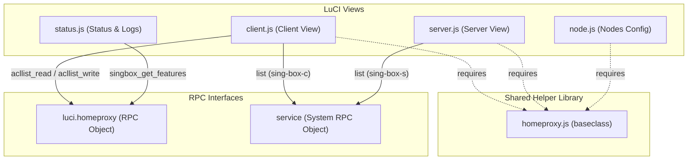

# OpenWrt HomeProxy Project Graph Wiki

Welcome to the **HomeProxy** CodeGraph & Project Architecture Wiki. This document outlines the structural analysis and codebase relationships of the OpenWrt HomeProxy Luci Application, powered by CodeGraph indexing.

---

## 📊 CodeGraph Index Status & Health

The project index is **100% Healthy** and fully synchronized.

* **Indexed Files:** 6
* **Total Nodes:** 24
* **Total Edges:** 34
* **Database Size:** 1.43 MB
* **Backend:** node:sqlite (full WAL + FTS5)
* **Journal Mode:** `wal` (Concurrent reads safe)

### Language Distribution
* **JavaScript:** 5 files (LuCI Client-side codebase)
* **YAML:** 1 file (GitHub Actions Workflow)

### Nodes by Kind
* **Functions:** 11
* **Constants:** 7
* **Files:** 5
* **Variables:** 1

---

## 🗺️ Project Architecture & Symbol Map

The following Mermaid diagram illustrates the structure of the front-end components and their shared dependency on the core helper library `homeproxy.js`.

---

## 🔍 Detailed Component Directory

### 1. 🛠️ Core Helper: `homeproxy.js`
* **Path:** `luci-app-homeproxy/htdocs/luci-static/resources/homeproxy.js`
* **Description:** A shared LuCI base class extension providing structural data mappings and utility helpers.
* **Key Capabilities:**
  * **Encryption Parameters:** Pre-defined maps for `shadowsocks_encrypt_length`, `shadowsocks_encrypt_methods`, `tls_cipher_suites`, and `tls_versions`.
  * **Utilities:** `calcStringMD5`, `decodeBase64Str`, `generateRand` (Base64, Hex, UUID).
  * **RPC Wrapper:** `getBuiltinFeatures` (calls `singbox_get_features` on `luci.homeproxy`).
  * **LuCI Widgets & Form Validators:**
    * `validateUniqueValue` — Prevents duplicate identifiers in UCI sections.
    * `validateUUID` / `validateBase64Key` / `validatePortRange` — Schema validation rules.
    * `validateCertificatePath` — Restricts certificate uploads to `/etc/homeproxy/certs/`, `/etc/acme/`, or `/etc/ssl/`.

### 2. 💻 Client Configuration View: `client.js`
* **Path:** `luci-app-homeproxy/htdocs/luci-static/resources/view/homeproxy/client.js`
* **Description:** Manages the main Client configurations and routing mode rules.
* **Key Symbols & Interactions:**
  * `callServiceList`: Declare RPC to system `service` to query state.
  * `getServiceStatus()`: Resolves status of `homeproxy` service specifically for `sing-box-c` (Client instance).
  * `renderStatus(isRunning, version)`: Outputs green/red HTML indicator for the frontend.
  * `callReadDomainList` & `callWriteDomainList`: Read/Write custom ACL lists using `luci.homeproxy` (`acllist_read`, `acllist_write`).

### 3. 🖥️ Server Configuration View: `server.js`
* **Path:** `luci-app-homeproxy/htdocs/luci-static/resources/view/homeproxy/server.js`
* **Description:** Manages inbound Server configurations (sing-box servers).
* **Key Symbols & Interactions:**
  * `getServiceStatus()`: Queries the system service to check state of `sing-box-s` (Server instance).
  * `renderStatus(isRunning, version)`: Outputs status indicators for server processes.
  * `handleGenKey`: Automatically handles private/public key generation for inbound protocols.

### 4. 🎛️ Node Config View: `node.js`
* **Path:** `luci-app-homeproxy/htdocs/luci-static/resources/view/homeproxy/node.js`
* **Description:** Renders and handles parameters for proxy nodes.
* **Key Features:**
  * `renderNodeSettings(...)`: Multi-protocol support rendering custom forms dynamically. Supports `direct`, `anytls`, `http`, `hysteria`, `hysteria2`, `shadowsocks`, `shadowtls`, `socks`, `ssh`, `trojan`, `tuic`, `wireguard`, `vless`, `vmess`.
  * Fully utilizes helpers from `homeproxy.js` for modular validators (e.g., `hp.validateUniqueValue`).

### 5. 📈 Connection Status & Logs View: `status.js`
* **Path:** `luci-app-homeproxy/htdocs/luci-static/resources/view/homeproxy/status.js`
* **Description:** Provides connection testing utilities (e.g., Latency/DNS tests) and real-time logs textarea streaming.
* **Key Details:**
  * Logs workspace points to `/var/run/homeproxy`.
  * Utilizes `getConnStat()` to measure performance.
